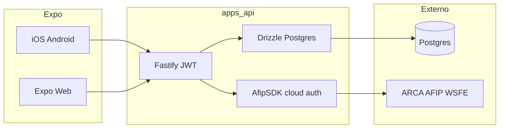

# Arquitectura TUFACT

- **1 usuario = 1 CUIT**: tabla `user_fiscal_profile` 1:1 con `users`.
- **Secretos**: certificado y clave PEM solo en servidor, cifrados con `ENCRYPTION_KEY`.
- **SDK**: `@afipsdk/afip.js` obtiene TA vía API AfipSDK y llama WSFE (FECAESolicitar) según configuración del SDK.
